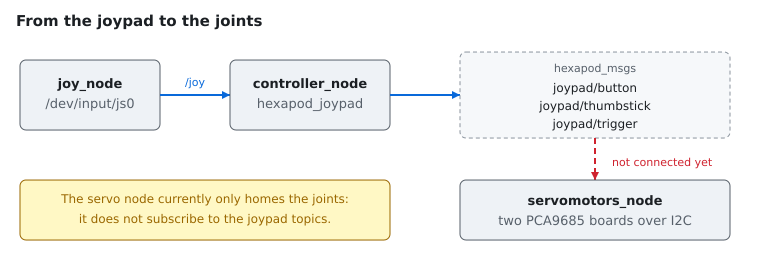

# hexapod_ws

ROS 2 workspace for an eighteen degree-of-freedom hexapod: a PS3 joypad drives
eighteen servos through two Adafruit PCA9685 boards on the I²C bus of a
Raspberry Pi.



- [Requirements](#requirements)
- [Build](#build)
- [Test](#test)
- [Install](#install)
- [Run](#run)
- [Packages](#packages)
- [Documentation](#documentation)
- [Licence](#licence)

## Requirements

| | |
|---|---|
| ROS 2 | Jazzy (any distribution works; nothing hard-codes one) |
| Compiler | C++20, strict ISO, no GNU extensions |
| System libraries | `liblua5.3-dev`, `libi2c-dev` |
| Fetched at configure time | [sol2](https://github.com/ThePhD/sol2), when not already installed |
| Hardware | Raspberry Pi with I²C enabled, two PCA9685 boards, separate 5 V servo supply |

The supported environment is the dev container in
[`.devcontainer`](.devcontainer), which pins Ubuntu 24.04, ROS 2 Jazzy and
clang. Upgrading either means changing `ROS_DISTRO` or `LLVM_VERSION` in
`devcontainer.json` and rebuilding the image; nothing else is version-specific.

Outside the container, install the dependencies with `rosdep`:

```sh
source /opt/ros/$ROS_DISTRO/setup.bash
rosdep install --from-paths src --ignore-src -y
```

### On a Raspberry Pi

One command takes a freshly flashed Raspberry Pi 4 Model B or 5 to the point
where the workspace builds — packages, ROS 2, `rosdep`, the I²C interface, and a
build sized for the memory the board actually has:

```sh
./scripts/install-raspberrypi.sh          # --dry-run first, if you prefer
```

Run it as your normal user, not with `sudo`. It is idempotent, so re-running it
after a failure or a reboot only does the work still missing.

The robot must run **Ubuntu Server 24.04 LTS, 64-bit**. Raspberry Pi OS is
Debian based and `packages.ros.org` publishes no suite for it, so ROS 2 cannot
be installed from apt there at all — the script checks and stops rather than
leaving a half-configured system. See
[the Raspberry Pi notes](doc/raspberry-pi.md) for the flags, what resolves
itself, and what to do when a step fails.

## Build

```sh
./build_exapod.sh                 # colcon build of the whole workspace, Release
```

or, for one package at a time:

```sh
source /opt/ros/$ROS_DISTRO/setup.bash
colcon build --symlink-install --packages-select hexapod_msgs
colcon build --symlink-install --packages-select hexapod_servomotor
```

`--symlink-install` is worth having: the Lua scripts and the launch files are
read from the install tree, so with symlinks an edit takes effect without
rebuilding.

Install the git hooks once per clone (the dev container does it for you):

```sh
pre-commit install
pre-commit run --all-files
```

## Test

```sh
colcon test --event-handlers console_direct-
colcon test-result --all --verbose
```

**No test needs the robot.** They cover the joypad value remapping, the motor
model and the angle-to-pulse mapping, the PCA9685 frequency arithmetic taken
from the data sheet and its argument validation, the generated message fields,
and the URDF together with every mesh it refers to. Anything that would open
`/dev/i2c-*` is deliberately out of scope, so the suite runs on a laptop.

Run one package on its own with `--packages-select`, for instance:

```sh
colcon test --packages-select hexapod_servomotor
```

`colcon test` exits quietly when a package has nothing to run, so read the
counts from `colcon test-result` rather than trusting the exit code.

## Install

The workspace installs into `install/` and is used as an overlay:

```sh
source install/setup.bash
```

Add it to your shell profile to get it in every terminal:

```sh
echo "source $(pwd)/install/setup.bash" >> ~/.bashrc
```

### On the robot

The servo node needs access to the I²C bus.
[`scripts/install-raspberrypi.sh`](scripts/install-raspberrypi.sh) does this as
part of the setup: it enables the interface, loads `i2c-dev` at boot and adds
you to the `i2c` and `input` groups. By hand, the same thing is:

```sh
sudo raspi-config          # Interface Options -> I2C -> enable
sudo usermod -aG i2c "$USER"
```

Either way a reboot — or at least a fresh login — is required before the group
takes effect.

Check that both boards answer before running anything:

```sh
sudo apt install i2c-tools
i2cdetect -y 1             # expect 40 and 41
```

If only `40` appears, the second board still has its stock address: solder its
`A0` jumper. See [the wiring notes](doc/pca9685.md#wiring).

## Run

Everything at once — joystick driver, remapper and servos:

```sh
ros2 launch hexapod_joypad hexapod_joypad.launch.py
```

Without the hardware, on a development machine:

```sh
ros2 launch hexapod_joypad hexapod_joypad.launch.py with_servos:=false
ros2 topic echo /joypad/thumbstick
```

Individual pieces:

```sh
# servos only, with the parameters from config/
ros2 launch hexapod_servomotor hexapod_servomotor.launch.py

# the URDF model in RViz, with joint sliders
ros2 launch hexapod_description display.launch.py

# a different joystick device, i.e. /dev/input/js1
ros2 launch hexapod_joypad hexapod_joypad.launch.py device_id:=1

# verbose, showing every register write
ros2 run hexapod_servomotor hexapod_servomotor_node --ros-args --log-level debug
```

> **Bench test.** `perform_startup_test:=true` sweeps every joint across its
> whole travel at startup. It is off by default because it knocks an assembled
> robot over. Only enable it with the body supported and the legs free.

The node validates its configuration and the I²C bus before moving anything, and
exits with a message rather than a guess if either is wrong. On exit — including
a crash — both boards switch their outputs off, so the joints are left
unpowered instead of holding their last command.

## Packages

| Package | Role |
|---|---|
| `hexapod_msgs` | `JoypadButton`, `JoypadThumbstick`, `JoypadTrigger` |
| `hexapod_joypad` | Remaps `sensor_msgs/msg/Joy` into those messages |
| `hexapod_servomotor` | Drives the servos through two PCA9685 boards |
| `hexapod_description` | URDF model and meshes |

Subscribing to the remapped topics:

```cpp
#include "hexapod_msgs/msg/joypad_trigger.hpp"

// inside a class deriving from rclcpp::Node
subscriber_ = create_subscription<hexapod_msgs::msg::JoypadTrigger>(
    "joypad/trigger", 10,
    std::bind(&Clss::functionCallback, this, std::placeholders::_1));
```

The PS3 button and axis layout is documented in
[the architecture notes](doc/architecture.md#the-joypad-chain). To pair the
controller, follow [this guide](https://pimylifeup.com/raspberry-pi-playstation-controllers/).

## Documentation

| Document | Contents |
|---|---|
| [Setting up a Raspberry Pi](doc/raspberry-pi.md) | The install script, the supported image, I²C, build memory, troubleshooting |
| [The PCA9685 servo board](doc/pca9685.md) | PWM generation, registers, timing, wiring, driver validation |
| [Configuring the robot](doc/configuration.md) | Node parameters, the Lua scripts, tuning, reading the logs |
| [Architecture](doc/architecture.md) | Packages, topics, failure behaviour |
| [CLAUDE.md](CLAUDE.md) | Coding standard and working rules for this repository |

## Licence

MIT — see [LICENSE](LICENSE). Copyright © 2021-2026 Francesco Argentieri.
