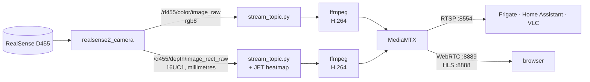

# Streaming the camera

The D455 publishes into the ROS graph, which is the right place for it and the
wrong place to look at it from. This turns the two camera topics into ordinary
RTSP streams, the kind Frigate, Home Assistant, VLC and a browser already know
how to open.

- [The chain](#the-chain)
- [What comes out](#what-comes-out)
- [The heatmap is not depth](#the-heatmap-is-not-depth)
- [Nothing runs until somebody watches](#nothing-runs-until-somebody-watches)
- [Running it](#running-it)
- [Parameters](#parameters)
- [What it costs](#what-it-costs)
- [The hardware encoder](#the-hardware-encoder)
- [Frigate and Home Assistant](#frigate-and-home-assistant)
- [What this does not do](#what-this-does-not-do)

## The chain



`stream_topic.py` lives in `hexapod_perception`; MediaMTX starts it through the
`hexapod-stream` wrapper the image puts on the PATH.

## What comes out

| Path | Source topic | Size | Encoding |
|---|---|---|---|
| `rtsp://<pi>:8554/color` | `/d455/color/image_raw` | 640×480 | H.264, 2 Mb/s |
| `rtsp://<pi>:8554/depth` | `/d455/depth/image_rect_raw` | 848×480 | H.264, 4 Mb/s |

The same two are served as WebRTC at `http://<pi>:8889/color/` and as HLS at
`http://<pi>:8888/color/index.m3u8`. WebRTC has the lowest latency and needs no
plugin; HLS plays on iOS and Safari, at the cost of several seconds.

WebRTC needs one more port than the page it is served from. MediaMTX also opens
**8189/UDP** for ICE, and `compose.yaml` publishes 8554, 8888 and 8889 but not
that one, so the container announces candidates on an address nothing outside
the bridge network can reach. The page loads and the video does not start.
Publishing `8189:8189/udp` and setting `webrtcAdditionalHosts` to the Pi's LAN
address is what fixes it; this has not been tested here. RTSP and HLS are
unaffected — both are TCP on ports that are published.

The depth stream is given twice the bitrate for a reason. False colour compresses
far worse than a photograph: the speckle of unresolved pixels changes every
frame and defeats inter-frame prediction. Measured on this camera, four seconds
of heatmap cost 1.6 MB against 141 KB for the same four seconds of colour.

## The heatmap is not depth

Depth arrives as `16UC1` — sixteen bits per pixel, one channel, the distance in
millimetres. H.264 carries eight-bit YUV. There is no flag that fixes this; the
format has nowhere to put those bits. So the stream carries a picture *of* the
depth rather than the depth itself: distances are clipped to a fixed window and
mapped onto a JET ramp, blue near, red far, black where the camera resolved
nothing.

It is something to look at, not something to measure with.

The colourising happens in `stream_topic.py`, not in the camera node, and that
is the whole point. `realsense2_camera` has a `colorizer` filter that does the
same job, but it **replaces** the depth topic: turn it on and
`/d455/depth/image_rect_raw` stops carrying millimetres and starts carrying
false colour, taking metric depth away from every other subscriber. Doing it in
the streaming path leaves the topic alone.

Two settings decide whether the result is readable:

- The window, `HEXAPOD_STREAM_DEPTH_MIN_M` and `..._MAX_M`. Everything outside
  it saturates at one end of the ramp.
- Histogram equalisation, which this node does not do. The camera node's
  colouriser has it **on** by default, and it renormalises the ramp on every
  frame, so the same colour means different distances from one frame to the
  next. A fixed window is what makes a colour mean a distance.

Pixels the camera could not resolve come through as zero. They are forced black
rather than left to clip to the near end of the ramp, where they would read as
an object right in front of the lens.

## Nothing runs until somebody watches

MediaMTX listens; it does not encode. On the first viewer it runs the command
for that path, and `runOnDemandCloseAfter` stops it ten seconds after the last
one leaves. A stream nobody has opened costs a listening socket.

This is not a refinement. On a four-core Pi 4 already running the robot, a
single 640×480 stream costs about a whole core, and leaving two of them running
for nobody is how the camera stops publishing altogether — see below.

## Running it

```sh
HEXAPOD_WITH_CAMERA=true HEXAPOD_WITH_STREAMING=true docker compose up -d
```

Streaming needs the camera. On its own it brings the server up over topics
nobody publishes: the paths exist, and a viewer asking for one gets a command
that finds no images and gives up. That is deliberate — the server is cheap, and
it lets the camera come and go underneath it.

Check it without installing anything:

```sh
ffprobe -rtsp_transport tcp rtsp://<pi>:8554/color        # codec, size, rate
ffplay  -rtsp_transport tcp rtsp://<pi>:8554/depth        # watch it
```

## Parameters

Environment variables in `compose.yaml`, read by the streaming node.

| Variable | Default | Meaning |
|---|---|---|
| `HEXAPOD_WITH_STREAMING` | `false` | start the RTSP server |
| `HEXAPOD_STREAM_ENCODER` | `libx264` | ffmpeg encoder; `h264_v4l2m2m` uses the Pi 4 hardware |
| `HEXAPOD_STREAM_BITRATE` | `2M` | fallback only, see below |
| `HEXAPOD_STREAM_FPS` | `30` | frame rate declared to ffmpeg |
| `HEXAPOD_STREAM_DEPTH_MIN_M` | `0.3` | near end of the heatmap window |
| `HEXAPOD_STREAM_DEPTH_MAX_M` | `4.0` | far end of the heatmap window |
| `HEXAPOD_RTSP_PORT` | `8554` | published RTSP port |
| `HEXAPOD_HLS_PORT` | `8888` | published HLS port |
| `HEXAPOD_WEBRTC_PORT` | `8889` | published WebRTC port |

The two paths and their commands are in
`src/hexapod_perception/config/mediamtx.yml`.

`HEXAPOD_STREAM_BITRATE` is the odd one out: it is only the argparse default,
and `mediamtx.yml` passes `--bitrate` explicitly on both paths, which wins.
Setting it changes nothing until that argument is taken out of the path's
command. The other four are read as written, because `mediamtx.yml` does not
pass them.

## What it costs

Measured on a Pi 4 Model B, one 640×480 colour stream, software encoder:

| | Share of one core |
|---|---|
| `realsense2_camera` | 43 % |
| `ffmpeg`, `libx264` | 37 % |
| `stream_topic.py` | 20 % |
| MediaMTX, idle | 2 % |
| **a browser watching it, on the Pi itself** | **73 %** |

Two things follow. Producing one stream costs about a core, so two streams and
the robot together do not fit comfortably in four. And watching costs more than
producing, so open the stream from another machine — pointing the Pi's own
browser at it is the most expensive way to look at the camera.

This is not theoretical. Running two streams while a browser watched one pushed
the load average past twenty, and `/d455/color/image_raw` **stopped publishing
altogether** — not a fault, starvation. It came back at 29.9 Hz on its own once
the load dropped.

## The hardware encoder

The Pi 4 has an H.264 encoder in hardware at `/dev/video11`
(`bcm2835-codec-encode`), and `HEXAPOD_STREAM_ENCODER=h264_v4l2m2m` uses it for
roughly a quarter of the CPU. It is not the default, for two reasons.

There is one of it. Two streams contend, and the second to start can take the
first down.

And it can be left wedged. A process killed mid-encode does not always release
it: the next `ffmpeg` blocks inside `bcm2835_codec_open` and stays there, in a
state `timeout` cannot clear. Recovering it means reloading the `bcm2835_codec`
module or rebooting. `libx264` costs more and has no such failure mode.

The Pi 5 has no hardware H.264 encoder at all.

## Frigate and Home Assistant

Both take an RTSP URL directly. `rtsp://<pi>:8554/color` is an ordinary H.264
camera as far as either is concerned.

The depth path is a different matter. Home Assistant will display it, and it is
worth displaying. Frigate will ingest it and find nothing useful: its detectors
are trained on ordinary photographs, and a false-colour distance map is not one.
Point Frigate at `color` and leave `depth` to Home Assistant.

## What this does not do

- **No audio.** The D455 has no microphone.
- **No authentication.** MediaMTX is configured open, on the assumption the Pi
  is on a home network. Anyone who can reach the port can watch.
- **No recording.** Streams are live only; Frigate or Home Assistant do the
  recording if you want it.
- **No metric depth over the wire.** The heatmap is a picture. Anything that
  needs millimetres subscribes to `/d455/depth/image_rect_raw` inside the ROS
  graph, where they are untouched.
- **No infrared or point cloud.** Only the colour and depth topics are served.
