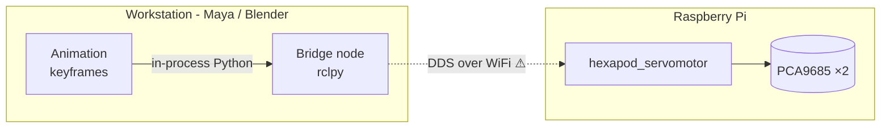
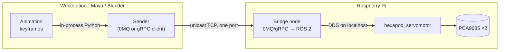
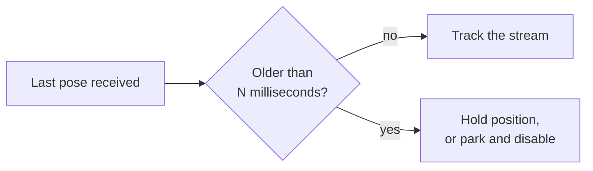
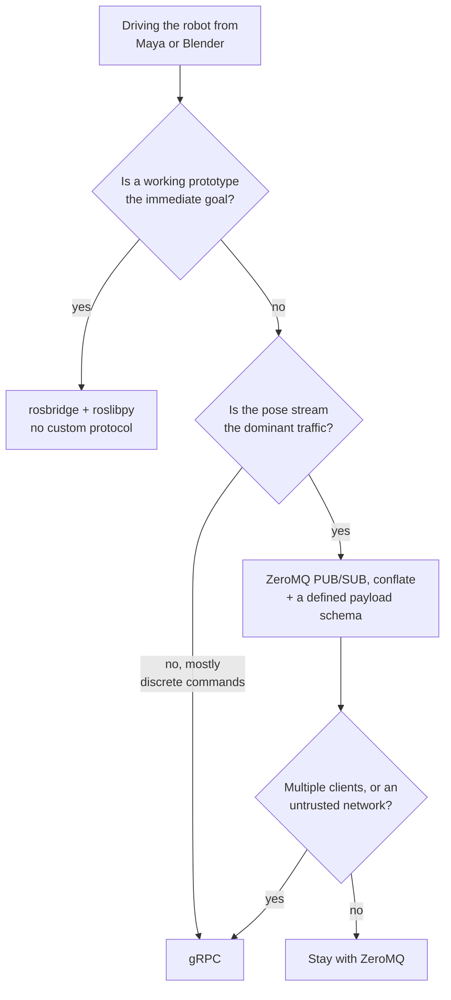

# Driving the hexapod from Maya or Blender

Choosing the transport between an animation package on a workstation and the
ROS 2 nodes on the Raspberry Pi. This document compares **ZeroMQ** and **gRPC**,
sets out where the bridge should sit, and records the measurements that decide
it. No implementation is proposed here — this is the decision, not the design.

- [The numbers that decide it](#the-numbers-that-decide-it)
- [Where the bridge belongs](#where-the-bridge-belongs)
- [ZeroMQ](#zeromq)
- [gRPC](#grpc)
- [Head to head](#head-to-head)
- [The dimension that actually matters](#the-dimension-that-actually-matters)
- [Dependency risk inside a DCC](#dependency-risk-inside-a-dcc)
- [Also worth considering](#also-worth-considering)
- [Recommendation](#recommendation)
- [Fix this first](#fix-this-first)

## The numbers that decide it

Measure before choosing. The traffic this link has to carry is tiny, and the
robot is slow:

| Quantity | Value | Where it comes from |
|---|---|---|
| Joints | 18 | 6 legs × coxa/femur/tibia |
| Payload, one pose | ~144 bytes | 18 × `float64`, before any framing |
| Useful update rate | ≤ 50 Hz | `pwm_frequency: 50.0` — the servo cannot see faster |
| Bandwidth at 50 Hz | ~7 kB/s | 144 B × 50 |
| **Time to write one full pose** | **~900 ms** | `WriteOnMotor` sleeps `settle_time_` **per motor**, 18 × 50 ms |

That last row is the one that matters. `servocontroller.cc:255` sleeps after
every individual servo command, and the pose loop calls it once per motor, so
with the shipped `settle_time_ms: 50` the robot accepts roughly **1.1 poses per
second**.

### Where the time actually goes

```
  network transport    ▏                                       0.2 – 10 ms   (wired – WiFi)
  serialisation        ▏                                       < 1 ms
  ROS 2 / DDS, local   ▏                                       < 1 ms
  I²C transfers ×18    █                                       ~10 – 40 ms   (estimate, 100 kHz bus)
  settle_time_ms ×18   ████████████████████████████████████    900 ms        (exact, from the code)
                       └────────────────────────────────────┘
                        0                                   900 ms
```

Only the last bar is measured from the source; the I²C figure is an estimate
from the bus clock and transfer size and has not been timed on hardware.

**A transport decision cannot be made on performance here.** Either candidate
moves 7 kB/s with latency three orders of magnitude below the robot's own
response time. The choice has to be made on *semantics*, *dependency risk* and
*maintenance cost* instead.

## Where the bridge belongs

The proposal was an intermediate node on the workstation. That works, but *where
the ROS boundary sits* matters more than where the process runs, because it
decides what crosses the network.

### Topology A — ROS boundary on the workstation



The LAN hop is carried by **DDS**. This is the arrangement to be wary of: DDS
discovery leans on multicast, which is slow and lossy over WiFi, and every
participant chatters continuously. It is a well-known source of trouble for
ROS 2 over wireless links, and it puts a full ROS 2 installation inside — or
beside — the animation package.

### Topology B — ROS boundary on the Pi



DDS never leaves the Pi, so it runs over loopback where it behaves well. The
network hop is one explicit, unicast, firewall-friendly connection whose
protocol you control. The workstation needs **no ROS 2 installation at all** —
only a client library inside the DCC's Python.

**Topology B is the better arrangement**, and it is compatible with the original
idea: the "intermediate node" simply becomes a thin sender inside Maya/Blender
plus a bridge node on the Pi. Keep a workstation-side ROS installation only if
you want RViz and `ros2 topic echo` locally — and even then, prefer to run them
over SSH.

### The traffic has two shapes

This is easy to miss, and it drives the protocol choice more than anything else:

```
┌──────────────────────────────────────────────────────────────────────┐
│  POSE STREAM        18 floats, 30–50 Hz, continuous                  │
│                     → lossy is CORRECT. Newest pose wins.            │
│                       A stale pose is worse than no pose.            │
├──────────────────────────────────────────────────────────────────────┤
│  CONTROL COMMANDS   home, stop, enable, load gait, set parameter     │
│                     → rare, must not be lost, needs an answer        │
│                       ("did it home?"), needs a timeout.             │
└──────────────────────────────────────────────────────────────────────┘
```

One is telemetry. The other is RPC. No single pattern is ideal for both, and
each candidate is strong at one of them.

## ZeroMQ

A brokerless messaging library — sockets with patterns, framing and reconnection
built in. You supply the message format yourself.

### Pros

- **Loss semantics that fit a robot.** `PUB`/`SUB` with the *conflate* option
  keeps only the most recent message. A late pose is dropped rather than
  queued, which is exactly what a moving machine needs.
- **No backlog, ever.** When a subscriber cannot keep up, the high-water mark
  drops messages instead of growing an unbounded queue in front of the servos.
- **Tiny dependency on both ends.** `pyzmq` is a single wheel with `libzmq`
  bundled; on the Pi it is `libzmq3-dev` from apt plus header-only `cppzmq`.
  Next to nothing enters the link line beside `rclcpp`.
- **Brokerless.** No daemon to install, supervise or restart. One process on
  each side and a port.
- **Connection-agnostic.** A publisher does not care whether anyone is
  listening; Maya can be restarted, the Pi rebooted, and the link re-forms with
  no reconnection logic of your own.
- **Serialisation is your choice.** Raw floats, MessagePack, JSON or protobuf —
  you are not locked to one encoding, and can start simple.
- **Very low overhead**, and trivially debuggable at the socket level.
- **Patterns for the command traffic too**: `REQ`/`REP` for simple
  request-response, `DEALER`/`ROUTER` when it must survive losses.

### Cons

- **No schema and no contract.** Nothing stops the two ends from disagreeing
  about the message layout, and nothing tells you when they do — the failure is
  silent and arrives as garbage joint angles. This is precisely the class of
  fault this repository's rules exist to prevent, so the validation and a
  version field become *your* responsibility.
- **No versioning story.** Adding a field is a flag day unless you designed for
  it from the start.
- **`REQ`/`REP` is a trap.** The simple request-response pattern deadlocks if a
  message is lost; the robust pattern is more work than it looks.
- **No built-in security.** CurveZMQ exists but is extra design; there is no
  equivalent of "turn on TLS".
- **No introspection tooling.** There is no `grpcurl`, no reflection, no
  generated documentation. Debugging is packet-level.
- **Endpoints are hard-coded.** No discovery: the Pi's address lives in a
  configuration file.
- **Errors are not modelled.** Timeouts, retries and failure reporting are all
  hand-rolled.

## gRPC

An RPC framework: interfaces defined in a `.proto` file, code generated for both
ends, carried over HTTP/2.

### Pros

- **A real contract.** The `.proto` file is the single source of truth, and both
  ends are generated from it. The workstation and the robot cannot silently
  disagree about the message layout — a whole category of bug disappears.
- **Designed for evolution.** Numbered fields mean you can add data without
  breaking an older peer, which matters when the Pi and the workstation are
  updated at different times.
- **Proper RPC semantics** for the command traffic: deadlines, cancellation,
  status codes and a defined error model. "Home the robot, tell me when it is
  done, give up after 5 seconds" is one call.
- **Security is a switch.** TLS and authentication are part of the framework.
- **Tooling.** Reflection, `grpcurl`, interceptors for logging, health checking.
  You can exercise the robot's interface without writing a client.
- **Bidirectional streaming** in one connection, with HTTP/2 flow control
  providing genuine backpressure.
- **First-class in both languages** — Python and C++ are core targets, not
  community bindings.

### Cons

- **Reliable, ordered delivery is the wrong default here.** A stalled link
  queues poses and then replays them; see [below](#the-dimension-that-actually-matters).
  You *can* drop frames before sending, but you must build that yourself — the
  framework works against you.
- **Heavy on the Pi.** gRPC C++ brings protobuf and abseil into the same link
  line as `rclcpp`. It is apt-installable on Ubuntu 24.04, so no source build is
  needed, but version skew between C++ libraries pulling in the same
  dependencies is a known class of build pain, and this workspace currently
  links nothing of the sort.
- **Heavier inside the DCC.** `grpcio` is a large binary wheel and drags in
  `protobuf` — the more common source of version conflicts inside an
  application's bundled Python.
- **A build step in the loop.** Change the `.proto`, regenerate both sides,
  rebuild the C++ node. That is the price of the contract, but it is a real cost
  on a workspace where the Lua configuration was deliberately made
  recompilation-free.
- **Streams are stateful and die.** A dropped WiFi association kills the stream;
  re-establishing it and resuming cleanly is code you own.
- **More machinery than the problem needs** for a 7 kB/s link between two hosts
  you control.

## Head to head

| | ZeroMQ | gRPC |
|---|---|---|
| Model | Message patterns | Remote procedure call |
| Contract / schema | None — you invent it | `.proto`, generated both ends |
| Schema evolution | Manual, error-prone | Designed in |
| Streaming loss behaviour | **Drops stale, keeps newest** | **Queues and replays stale** |
| Backpressure | Drop at high-water mark | HTTP/2 flow control |
| Request-response | Possible, easy to get wrong | Native, with deadlines |
| Error model | Hand-rolled | Status codes, deadlines, cancellation |
| Security | CurveZMQ, extra work | TLS built in |
| Introspection | None | Reflection, `grpcurl` |
| Dependency on the Pi | `libzmq3-dev` + header-only | gRPC + protobuf + abseil |
| Dependency inside Maya/Blender | One small wheel | Large wheel + protobuf |
| Broker / daemon | None | None |
| Discovery | Hard-coded endpoint | Hard-coded endpoint |
| Build step on message change | None | Regenerate and rebuild |
| Fit for the pose stream | **Very good** | Fair — fighting the defaults |
| Fit for the command traffic | Fair | **Very good** |

## The dimension that actually matters

Everything above is secondary to this. Consider a 400 ms WiFi stall — utterly
routine — while streaming poses:

```
  frames produced   1  2  3  4  5  6  7  8  9 10 11 12
                          ├──── link stalled 400 ms ────┤

  gRPC / TCP        1  2                                3 4 5 6 7 8 9 10 11 12
  (reliable,                                            └──────────┬────────┘
   ordered)                                          replays 10 stale poses in a burst
                                                     → the legs re-run old motion
                                                       at maximum rate

  ZeroMQ CONFLATE   1  2                                12
  (newest wins)                                         └─ jumps straight to "now"
                                                        → one discontinuity, then correct
```

For a machine with 18 servos and its own mass, replaying a burst of stale poses
is not a performance question, it is a **safety** question. The repository's own
rules put it plainly: *hardware is stateful and unforgiving*.

ZeroMQ gives the correct behaviour by configuration. gRPC gives the dangerous
behaviour by default, and the correct behaviour only if you write the frame
dropping yourself and never regress it.

Neither, however, gives you a **watchdog** — and you need one regardless:



Whichever transport is chosen, the bridge node on the Pi must decide what
happens when the stream stops. That is a bigger safety decision than 0MQ versus
gRPC.

## Dependency risk inside a DCC

Maya and Blender each ship their own Python interpreter with their own bundled
libraries, and neither wants you rebuilding native extensions against it.

| | pyzmq | grpcio |
|---|---|---|
| Wheel available for the interpreters they ship | Yes | Yes |
| Approximate size | Small | Large |
| Extra runtime dependencies | None | `protobuf` |
| Native libraries bundled | `libzmq` | gRPC core, BoringSSL |
| Risk of clashing with the host application's own libraries | Low | Moderate — `protobuf` is a recurring offender |
| Pure-Python fallback if the wheel fails | No | No |

Both are installable in practice. The difference is the size of the surface you
are introducing into somebody else's application, and `pyzmq` is markedly the
smaller bet. This has not been tested against a specific Maya or Blender version
here, and should be confirmed against the exact versions in use before
committing.

## Also worth considering

The question was 0MQ versus gRPC, but two other options fit this problem well
and would be wrong to leave out.

### rosbridge + a pure-Python client

`rosbridge_suite` exposes ROS 2 topics and services over a WebSocket with JSON
payloads, and `roslibpy` talks to it with **no binary dependency whatsoever**.

- Nothing to compile, nothing to generate, no custom protocol to version, and
  no bridge node to write — you publish to a ROS topic directly from Maya.
- JSON is perhaps ten times more verbose than a binary encoding. At 7 kB/s this
  is irrelevant.
- It reintroduces reliable-ordered semantics, so the stale-pose problem returns
  and the frame dropping must be done on the sender.
- Adds a package on the Pi and one more process in the path.

For a first prototype this is very likely the fastest route from a Blender
keyframe to a moving joint, and it is worth trying before building anything
bespoke.

### Zenoh

`rmw_zenoh` is the ROS 2 middleware intended for exactly the situation where DDS
struggles — wireless and constrained links — and Zenoh has its own Python
bindings. It can make Topology A behave, and it can also serve as the wire
protocol in Topology B. It is the most interesting option to watch, and the
least settled.

MQTT is also viable and shares ZeroMQ's fire-and-forget character, but it wants
a broker, which is a process to run and supervise for no gain here.

## Recommendation



**Choose ZeroMQ**, in Topology B, for this robot:

1. The dominant traffic is a lossy pose stream, and ZeroMQ's conflate behaviour
   is the *safe* behaviour, by configuration rather than by discipline.
2. The dependency footprint is far smaller at both ends — which matters
   disproportionately inside Maya's Python and on a Pi that already builds
   `rclcpp` under a memory cap.
3. No performance argument favours gRPC here. Both are three orders of magnitude
   faster than the robot.
4. gRPC's genuine advantage — the schema — is recoverable cheaply: put
   **protobuf or MessagePack payloads inside ZeroMQ frames**. You get the
   contract and the versioning without the framework, the build step or the
   link-line weight. Carry an explicit schema version in every message and
   reject anything unrecognised, as the workspace already does for its Lua
   tables and node parameters.

**Choose gRPC instead if** the interface becomes a product rather than a private
link: several clients, other people writing against it, an untrusted network, or
interaction that is mostly discrete commands wanting deadlines and answers.

**Do not choose on throughput or latency.** Neither is the constraint.

## Fix this first

No transport will make the robot follow a 24 fps animation while
`WriteOnMotor` sleeps `settle_time_ms` after every one of the 18 motors. At the
shipped default that is 900 ms per pose, so the link would be idle 99% of the
time waiting for the servo node.

Before any of this is worth building, the write path needs to deliver a whole
pose without sleeping between motors — for example by writing all channels and
settling once, or by exploiting the PCA9685's register auto-increment to update
a board in a single transaction.

That is a change to how the hardware is driven, not a refactor:
`settle_time_ms` exists to give a servo time to reach its target and to spread
the current draw of eighteen motors moving at once. Removing it makes all
eighteen move together and pull peak current simultaneously, which is a decision
about the power supply and the mechanics — to be made deliberately, on a bench,
with the body supported.
