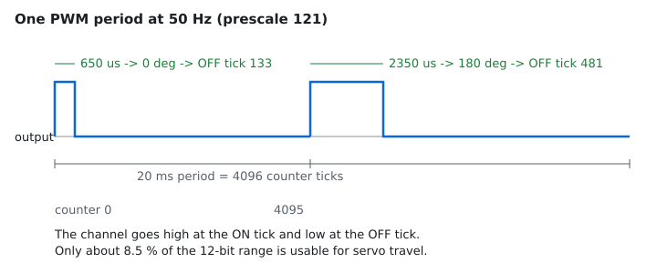
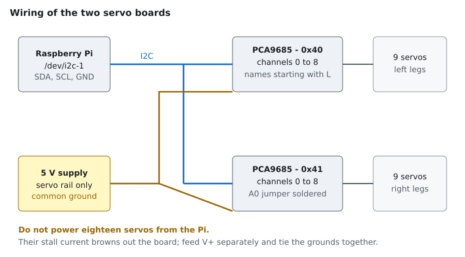

# The PCA9685 servo board

The robot drives its eighteen joints through two Adafruit 16-channel 12-bit
PWM/servo boards. Each board carries an NXP PCA9685, an I²C device that
generates sixteen independent PWM signals in hardware, so the host writes a few
registers and then has nothing left to do — no bit-banging, no timing jitter
from the operating system.

Everything below is taken from the NXP PCA9685 data sheet, revision 4.

## Features that matter here

| Property | Value | Why it matters |
|---|---|---|
| Channels | 16 per board | Nine joints per side, so two boards cover the robot |
| Resolution | 12 bit (0–4095) | About 4 µs of pulse resolution at 50 Hz |
| Oscillator | 25 MHz internal | Fixed unless `EXTCLK` selects an external clock |
| Output frequency | 24 Hz – 1526 Hz | Shared by all sixteen channels of a board |
| Addresses | 0x40 – 0x7F | Up to 62 boards on one bus |
| Output stage | Totem pole or open drain | Totem pole for servos, set in `MODE2` |

The frequency is a property of the **board**, not of the channel: all sixteen
outputs share one counter. Two boards mean two independent frequencies, but
every joint on the same board is refreshed at the same rate.

## How a channel produces a pulse

A single 12-bit counter runs from 0 to 4095 and wraps. Every channel has two
comparators: the output goes high at the `ON` value and low at the `OFF` value.
Because both edges are programmable, the phase is adjustable too — useful for
spreading the current draw of many servos across the period, which this project
does not yet exploit.



At 50 Hz one period lasts 20 ms and covers 4096 ticks, so one tick is about
4.9 µs. The servo pulses used here span 650 µs to 2350 µs, that is ticks 133 to
481: the whole travel of a joint lives in roughly 8.5 % of the counter range.
This is why the pulse limits are worth tuning — the resolution is limited by
where those two ends sit, not by the 12-bit counter itself.

Bit 12 of an `ON` or `OFF` high byte is special: it is the **full-ON** and
**full-OFF** flag, which latches the output instead of modulating it. Full-OFF
wins over full-ON. The driver uses full-OFF to park the outputs, and rejects any
counter value above 4095 so that an arithmetic slip cannot set the flag by
accident.

## Output frequency

    prescale = round(25 MHz / (4096 × frequency)) − 1

The hardware clamps the register at a minimum of 3, and it is one byte wide, so:

| Prescale | Frequency |
|---|---|
| 3 | 1526 Hz (maximum) |
| 121 | 50.0 Hz (servos) |
| 30 | 200 Hz (power-on default) |
| 255 | 24 Hz (minimum) |

Two consequences the driver handles explicitly:

- **The prescaler is an integer**, so the frequency you ask for is rarely the
  frequency you get. `GetActualFrequency()` returns what the board settled on,
  and the pulse-to-tick conversion uses that value rather than the request. A
  warning is logged when the two differ by more than 0.5 Hz.
- **`PRE_SCALE` only accepts a write while the device is asleep.** Changing the
  frequency therefore interrupts the outputs briefly.

## Registers used

| Address | Name | Purpose |
|---|---|---|
| 0x00 | `MODE1` | `RESTART`, `EXTCLK`, `AI`, `SLEEP`, sub-addresses, `ALLCALL` |
| 0x01 | `MODE2` | `INVRT`, `OCH`, `OUTDRV` (totem pole) |
| 0x06 + 4n | `LEDn_ON_L/H`, `LEDn_OFF_L/H` | Four registers per channel |
| 0xFA–0xFD | `ALL_LED_*` | Write every channel at once |
| 0xFE | `PRE_SCALE` | Output frequency |

`ALL_LED_*` is how the driver parks all sixteen outputs with four writes instead
of sixty-four.

## The wake-up sequence

The data sheet is strict about the order, and getting it wrong leaves the
oscillator unstable:

1. Set `SLEEP` in `MODE1` — the oscillator stops and `PRE_SCALE` becomes
   writable.
2. Write `PRE_SCALE`.
3. Restore the previous `MODE1`, clearing `SLEEP`.
4. **Wait at least 500 µs.** "The SLEEP bit must be logic 0 for at least 500 µs,
   before a logic 1 is written into the RESTART bit." The driver waits 1 ms.
5. Write `RESTART`. The channels that were active resume.

## Wiring



Both boards sit on the same bus, so they need different addresses. A stock
Adafruit board answers at 0x40; soldering the `A0` jumper moves it to 0x41,
which is what `right_driver_address` expects.

Two electrical points that cause most of the trouble:

- **Feed the servo rail from its own supply.** Eighteen servos stalling at once
  draw far more than a Raspberry Pi can provide, and the resulting brown-out
  looks like random I²C errors.
- **Tie the grounds together.** The board's logic ground and the servo supply
  ground must be common, or the PWM signal has no reference.

Check that the boards are visible before starting the node:

```sh
sudo apt install i2c-tools
i2cdetect -y 1        # expect 40 and 41 in the grid
```

Photographs of the assembled robot are in [`src/reference_img`](../src/reference_img).

## What the driver refuses to do

`PCA9685` validates before it writes, because every one of these mistakes is
silent on the bus and visible only as a joint moving somewhere unexpected:

| Check | Failure |
|---|---|
| Address within 0x40–0x7F | `std::invalid_argument` |
| Frequency within 24–1526 Hz (and not NaN) | `std::invalid_argument` |
| Channel within 0–15 | `std::invalid_argument` |
| `ON`/`OFF` within 0–4095 | `std::invalid_argument` |
| Any call before `Initialize()` | `std::logic_error` |
| Transient bus error | retried up to three times, then `std::system_error` |

Without the channel check, the register arithmetic `0x06 + 4 × channel` walks
straight into the registers of another channel — or into `PRE_SCALE`.

On destruction the board switches every output to full-OFF and goes to sleep, so
a process that exits or crashes leaves the joints unpowered instead of holding
their last command.

## Sources

- [PCA9685 data sheet (NXP, via Adafruit)](https://cdn-shop.adafruit.com/datasheets/PCA9685.pdf)
- [Understanding the PCA9685 hardware](https://deepwiki.com/adafruit/Adafruit-PWM-Servo-Driver-Library/3-understanding-the-pca9685-hardware)
- [Adafruit PWM Servo Driver Library](https://github.com/adafruit/Adafruit-PWM-Servo-Driver-Library)
