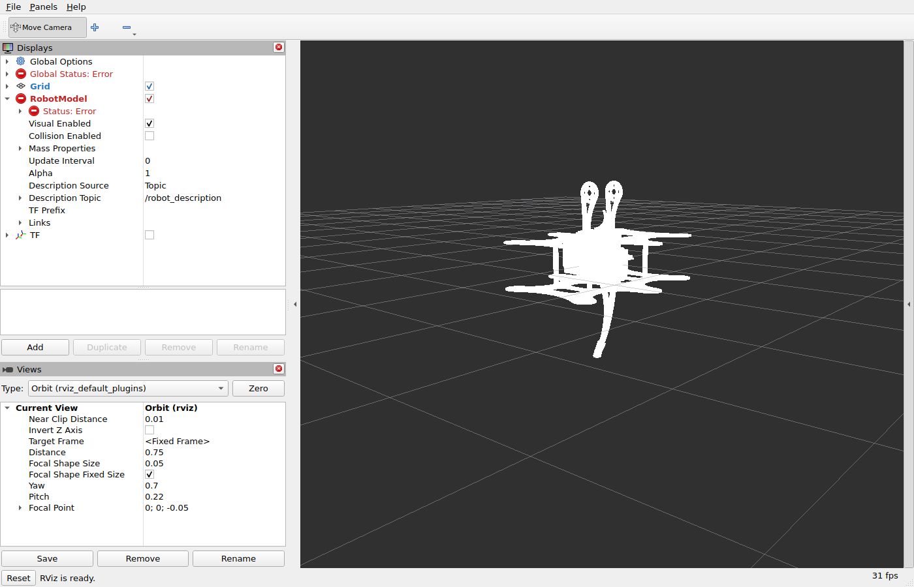
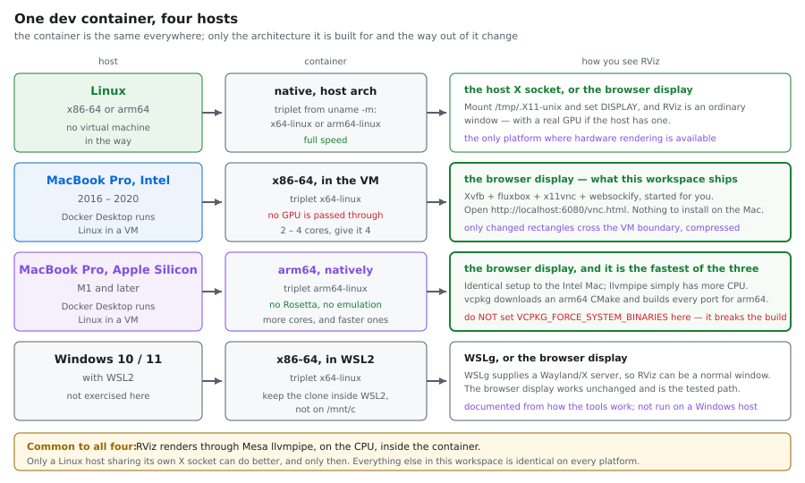
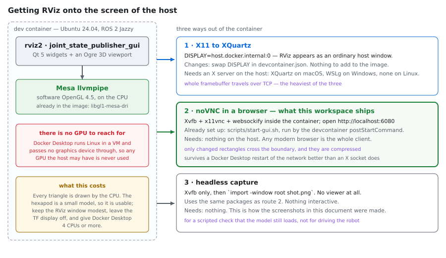
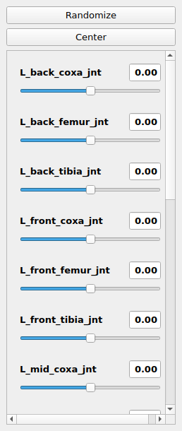
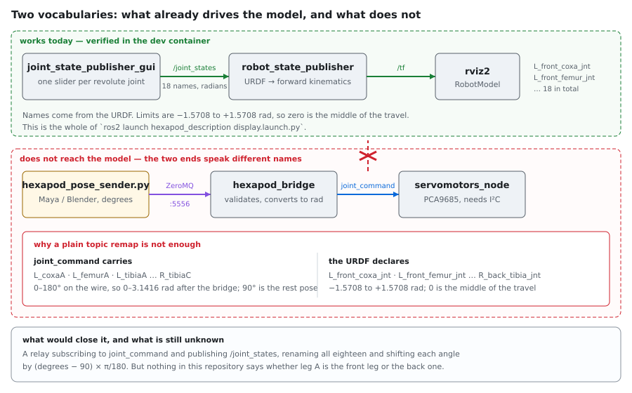

# Running the hexapod without a robot

Building the workspace and *seeing* it — RViz, the joint sliders, the ROS graph — on whatever
machine you have, from the dev container in [`.devcontainer`](../.devcontainer).

No Raspberry Pi, no PCA9685 boards, no I²C, no joypad. Everything below runs on the laptop, and
nothing has to be installed on the host beyond Docker and an editor.

- [Quick start](#quick-start)
- [Your host](#your-host)
- [What you can simulate — and what you cannot](#what-you-can-simulate--and-what-you-cannot)
- [The constraint that shapes everything: there is no GPU](#the-constraint-that-shapes-everything-there-is-no-gpu)
- [The display, and how it is put together](#the-display-and-how-it-is-put-together)
- [Seeing the robot: display.launch.py](#seeing-the-robot-displaylaunchpy)
- [Log messages you will see, and which of them matter](#log-messages-you-will-see-and-which-of-them-matter)
- [The ZeroMQ chain, without any GUI](#the-zeromq-chain-without-any-gui)
- [Where the dependencies come from](#where-the-dependencies-come-from)
- [LuaJIT](#luajit)
- [The joint-name gap](#the-joint-name-gap)
- [Keeping it smooth on an older machine](#keeping-it-smooth-on-an-older-machine)
- [A native window instead of a browser tab](#a-native-window-instead-of-a-browser-tab)
- [Troubleshooting](#troubleshooting)
- [Verified, and not verified](#verified-and-not-verified)

## Quick start

Open the folder in VS Code and **Dev Containers: Reopen in Container**. The display starts itself
— `postStartCommand` runs [`scripts/start-gui.sh`](../scripts/start-gui.sh) — so all that is left
is:

```sh
./build_exapod.sh                                   # or: colcon build --symlink-install
source install/setup.bash
ros2 launch hexapod_description display.launch.py
```

Then open <http://localhost:6080/vnc.html>. VS Code forwards the port automatically and offers the
link in its Ports panel.



That sequence is the same on every platform below. Nothing in the workspace branches on the host.

## Your host



The container is built for the architecture of the machine building it — the vcpkg triplet is
derived from `uname -m`, so nothing has to be told which machine it is on.

### Linux

The container runs directly on the kernel, with no virtual machine in between. Everything below
works as described, and it is the only platform where you can skip the browser display: share the
host's X socket and RViz becomes an ordinary window, on the host's real GPU if it has one. See
[a native window](#a-native-window-instead-of-a-browser-tab).

### macOS on Intel — MacBook Pro 2016 to 2020

Docker Desktop runs Linux in a virtual machine and passes no graphics device into it, so RViz
renders on the CPU. This is the machine the tuning advice in
[keeping it smooth](#keeping-it-smooth-on-an-older-machine) is aimed at: two or four cores, shared
between the software rasteriser and everything else.

Give Docker Desktop **4 CPUs and 8 GB** in *Settings ▸ Resources* if the Mac has them.

### macOS on Apple Silicon — M1 and later

The same picture, with two differences, both in your favour:

- **The container is arm64 and runs natively.** No Rosetta, no emulation. `uname -m` reports
  `aarch64` inside it, the vcpkg triplet becomes `arm64-linux`, and every dependency is compiled
  for arm64.
- **There is more CPU to give the software rasteriser**, which is exactly what llvmpipe scales
  with.

Two lines in the Dockerfiles decide whether this works at all, and they belong together:

```dockerfile
ENV VCPKG_FORCE_SYSTEM_BINARIES=1     # vcpkg uses the CMake and Ninja in the image
# ... and the image installs CMake from Kitware, not from Ubuntu
```

vcpkg's port scripts need CMake 3.31 or newer — they call `string(JSON ... STRING_ENCODE)` — and
Ubuntu 24.04 carries 3.28. Point vcpkg at *that* CMake and every port fails before compiling a
line, on arm64 exactly as on x86-64:

```
CMake Error at scripts/cmake/z_vcpkg_spdx.cmake:15 (string):
  string sub-command JSON got an invalid mode 'STRING_ENCODE'
```

Kitware's apt repository supplies a current CMake for `noble` on **amd64 and arm64 alike**, which
is what lets one arrangement serve an Intel Mac, an Apple Silicon Mac and the Raspberry Pi. Both
[`.devcontainer/Dockerfile.ros2`](../.devcontainer/Dockerfile.ros2) and
[`docker/Dockerfile`](../docker/Dockerfile) do it the same way, and the `apt-get install` ends in
`cmake --version` so the build log records which one was used.

**The two settings are a pair.** Keeping `VCPKG_FORCE_SYSTEM_BINARIES=1` while dropping back to
Ubuntu's CMake reintroduces the failure above; dropping the flag makes vcpkg download its own
CMake and Ninja instead, which also works — it publishes both for `linux/arm64` and `linux/amd64`
in `scripts/vcpkg-tools.json` — but costs a second copy of each. Change one, change the other.

### Windows with WSL2

Docker Desktop with the WSL2 backend runs the container the same way. Two notes, neither verified
on a Windows host:

- Keep the clone **inside the WSL2 filesystem**, not under `/mnt/c`. A `colcon build` across the
  9p mount is slow enough to be worth the move.
- WSLg already provides an X/Wayland server, so the [native window](#a-native-window-instead-of-a-browser-tab)
  route is available without installing anything. The browser display works unchanged and is the
  path that has actually been exercised.

## What you can simulate — and what you cannot

| | |
|---|---|
| ✅ The URDF model in RViz | `hexapod_description` installs the model, its DAE meshes and the RViz configuration |
| ✅ Moving all eighteen joints by hand | `joint_state_publisher_gui`, one slider per joint |
| ✅ The ZeroMQ pose stream end to end | `hexapod_pose_sender.py` → `hexapod_bridge` → `joint_command` |
| ✅ The joypad override logic | publish onto `joypad/button` by hand and watch the bridge freeze |
| ✅ The whole ROS graph | `ros2 topic list`, `ros2 topic echo`, `ros2 node info` |
| ⚠️ The joypad itself | Docker Desktop cannot pass `/dev/input/js0` out of its virtual machine; a real PS3 pad is reachable only on a Linux host |
| ⚠️ The servo node | it opens `/dev/i2c-1` at start-up, which no laptop has — always launch with `with_servos:=false` |
| ❌ The streamed pose animating the RViz model | the bridge and the URDF use different joint names — see [the joint-name gap](#the-joint-name-gap) |
| ❌ Physics, contact, gravity, falling over | there is no Gazebo/Ignition setup in this workspace, and the URDF carries no collision geometry to drive one |

That last row deserves bluntness: **"simulate" here means visualise and exercise the message
plumbing, not dynamic simulation.** There is no physics engine in this repository.

## The constraint that shapes everything: there is no GPU



Docker Desktop — on macOS and on Windows alike — runs Linux inside a virtual machine and passes no
graphics device into it. Whatever you do, RViz's Ogre renderer falls back to Mesa's **llvmpipe**
software rasteriser, on the CPU, inside the container. On a Linux host the same is true by default,
and there alone you can opt out of it.

That is less bad than it sounds for a model this size. Inside the image RViz reports

```
[INFO] [rviz2]: OpenGl version: 4.5 (GLSL 4.5)
```

and holds a usable frame rate on the hexapod. The environment variables that keep it on that path
rather than failing in a GLX error are set for you in `devcontainer.json`:

```jsonc
"containerEnv": {
    "DISPLAY": ":99",
    "LIBGL_ALWAYS_SOFTWARE": "1",
    "GALLIUM_DRIVER": "llvmpipe",
    "QT_X11_NO_MITSHM": "1",
    "QT_QPA_PLATFORM": "xcb",
    "ROS_AUTOMATIC_DISCOVERY_RANGE": "LOCALHOST"
}
```

Confirm which renderer you actually got — `mesa-utils` is in the image for exactly this question:

```sh
glxinfo -B | grep -E 'OpenGL renderer|OpenGL version'
```

## The display, and how it is put together

The container carries its own X server rather than borrowing one from the host. Four processes,
started by `scripts/start-gui.sh`:

| Process | Role |
|---|---|
| `Xvfb :99` | An X server with no monitor behind it. 1280×800 by default |
| `fluxbox` | A window manager. Without one, RViz and the slider window both open at the top-left corner with no title bar and cannot be moved |
| `x11vnc` | Exports that screen on port 5901 |
| `websockify` | Serves the noVNC client on port 6080 and bridges the browser's WebSocket to 5901 |

The script is idempotent, so running it again is free:

```sh
bash scripts/start-gui.sh
```

Only the changed regions of the screen cross the boundary, compressed, which is why this is lighter
than forwarding X11 — where the whole framebuffer travels for every repaint.

A bigger or smaller screen, without editing anything:

```sh
GEOMETRY=1920x1200x24 bash scripts/start-gui.sh   # after killing the running Xvfb
```

`vnc_lite.html` is also served and drops the noVNC toolbar, which is worth having on a small
laptop screen.

## Seeing the robot: `display.launch.py`

```sh
ros2 launch hexapod_description display.launch.py
```

Three nodes and three arguments:

| Argument | Default | Effect |
|---|---|---|
| `gui` | `true` | start `joint_state_publisher_gui` — the sliders |
| `rviz` | `true` | start `rviz2` |
| `rviz_config` | the installed `hexapod.rviz` | which configuration RViz opens |

```sh
ros2 launch hexapod_description display.launch.py rviz:=false            # sliders and TF only
ros2 launch hexapod_description display.launch.py gui:=false             # model at its zero pose
ros2 launch hexapod_description display.launch.py rviz_config:=/tmp/x.rviz
```

The launch file reads the URDF at *launch* time and passes the whole document as the
`robot_description` parameter, so **editing the URDF means re-running the launch**, and re-running
`colcon build` unless the workspace was built with `--symlink-install`.

### The RViz configuration

[`src/hexapod_description/rviz/hexapod.rviz`](../src/hexapod_description/rviz/hexapod.rviz) is
installed into the package share directory and opened by default. It exists because RViz's stock
configuration has **no RobotModel display** and a Fixed Frame of `map`, which this model does not
have — so RViz opens on an empty scene and says why only in a panel nobody has open.

Three choices in it are about software rendering rather than taste:

- the **TF display is off**. Eighteen joints is eighteen frame triads plus labels, and it is the
  single most expensive thing in the scene. Switch it on when a transform is in question;
- the **grid is 20 cells of 0.1 m**, which frames a robot 0.35 m across and no more;
- the window is **1240×760**, sized to sit inside the 1280×800 display.

A test keeps it honest: `test_urdf.py` checks the file exists, that the launch file names it, and
that its Fixed Frame is a link the URDF actually declares.

### What you actually see

Two observations worth having in advance, both verified in the container.

**The model arrives white.** The DAE meshes render untextured under llvmpipe. Nothing is broken.

**The feet hang below the body and do not follow the legs.** That is the URDF, not the renderer.
Six foot joints and the body joint are declared `type="floating"`, and `kdl_parser` does not
support floating joints — it converts each into a fixed one and says so. Each foot's parent is
`root_jnt` rather than the tibia above it, so once fixed it stays pinned at its own origin
(`z = −0.117`) whatever the leg does. The eighteen revolute joints move correctly; the feet are
decoration that does not track them.

### The sliders



**Randomize** and **Center** are the fastest proof that the model is really being driven. The
range comes from each joint's `<limit>`: −1.5708 to +1.5708 radians, so 0 is mid-travel.

```console
$ ros2 topic echo /joint_states --once
name:
- L_back_coxa_jnt
- L_back_femur_jnt
- L_back_tibia_jnt
- L_front_coxa_jnt
- L_front_femur_jnt
- L_front_tibia_jnt
- L_mid_coxa_jnt
- L_mid_femur_jnt
- L_mid_tibia_jnt
- R_back_coxa_jnt
- R_back_femur_jnt
- R_back_tibia_jnt
- R_front_coxa_jnt
- R_front_femur_jnt
- R_front_tibia_jnt
- R_mid_coxa_jnt
- R_mid_femur_jnt
- R_mid_tibia_jnt
```

## Log messages you will see, and which of them matter

All observed in the container. None of them stops the model from displaying.

| Message | What it is |
|---|---|
| `kdl_parser: Converting unknown joint type of joint 'L_back_foot_jnt' into a fixed joint` × 7 | The six feet and `body_jnt` are `type="floating"`. Expected; see [above](#what-you-actually-see) |
| `kdl_parser: The root link root_jnt has an inertia specified in the URDF, but KDL does not support a root link with an inertia` | `root_jnt` carries a placeholder `<inertial>` (mass 0.001). Harmless for visualisation |
| `rviz2: The link L_mid_femur_jnt has unrealistic inertia, so the equivalent inertia box will not be shown` (several links) | RViz's own check on the exported inertia tensors |
| RobotModel display shows a red **Status: Error** | Observed together with the message above. Whether that message is the cause was **not** established — the model renders regardless. Expand the status node in the Displays panel to read the reason |
| `QStandardPaths: XDG_RUNTIME_DIR not set` | Qt housekeeping in a container with no session. Ignorable |
| `rviz2: Stereo is NOT SUPPORTED` | Informational |

The inertia values are what the mesh export produced. Replacing them is a modelling decision about
the real robot, not a visualisation fix, and is out of scope here.

## The ZeroMQ chain, without any GUI

The animation link needs no display: it is one TCP socket and some JSON.

```sh
colcon build --symlink-install --packages-select hexapod_msgs hexapod_bridge
source install/setup.bash

ros2 launch hexapod_bridge hexapod_bridge.launch.py                       # the bridge alone
ros2 launch hexapod_bridge hexapod.launch.py with_servos:=false with_joypad:=false
```

> **`with_servos:=false` is not optional on a laptop.** `ServoController` opens the `i2c_bus`
> parameter's device while it is being constructed — `/dev/i2c-1`, which no laptop has — and the
> node exits non-zero rather than degrading into a default. That is by design; do not "fix" it by
> pointing the parameter somewhere else.

In a second terminal, send poses. `pyzmq` is not in the image:

```sh
pipx install pyzmq 2>/dev/null || pip3 install --user pyzmq
python3 tools/hexapod_pose_sender.py --rate 10
```

and in a third, watch them arrive:

```sh
ros2 topic echo /joint_command
ros2 topic hz /joint_command          # should track --rate
ros2 node info /hexapod_bridge
```

No `--endpoint` is needed from the workspace root: `endpoint_from_configuration()` reads
`bridge.yaml` and rewrites the `0.0.0.0` the bridge *binds* into the `127.0.0.1` a client
*connects* to.

### Exercising the joypad override with no joypad

The bridge freezes the stream on any button press, or any thumbstick push past
`thumbstick_deadzone`. Both are ordinary topics:

```sh
ros2 topic pub --once /joypad/button hexapod_msgs/msg/JoypadButton '{value: 1}'
# [WARN] [hexapod_bridge]: joypad took over, the joints are frozen at their last angles
# ... and 1500 ms after the last input:
# [INFO] [hexapod_bridge]: joypad released, the streamed poses drive the joints again
```

The thumbstick path keys off `vector_magnitute` — the spelling is part of the message interface
and is preserved deliberately:

```sh
ros2 topic pub --once /joypad/thumbstick hexapod_msgs/msg/JoypadThumbstick '{vector_magnitute: 0.9}'
```

## Where the dependencies come from

**vcpkg first; `FetchContent` only for what vcpkg does not carry.** The dev container bootstraps
vcpkg exactly the way [`docker/Dockerfile`](../docker/Dockerfile) does — same `VCPKG_ROOT`, same
`/opt/vcpkg_installed` tree, same triplet derived from `uname -m` — and resolves
[`vcpkg.json`](../vcpkg.json) once while the image is built:

```
cppzmq · eigen3 · fmt · luajit · nlohmann-json · sol2 · zeromq
```

**Neither image asks apt for any of those seven.** That is deliberate. An apt copy alongside the
vcpkg one is a second, differently versioned answer to the same `find_package()`, and whichever
wins, the dev container stops predicting what the robot builds. Only two system libraries are
requested, because neither can come from the manifest:

| | |
|---|---|
| `libi2c-dev` | kernel userspace bindings; vcpkg has no port |
| `liblua5.3-dev` | the fallback runtime, and the source of `luac5.3` that the `lua-syntax` hook runs |

One of the seven arrives anyway, and it is worth knowing before a `dpkg -l` misleads you:
`libfmt-dev` 9.1.0 is a transitive dependency of `libspdlog-dev`, which ROS pulls in for
`rcl_logging_spdlog`. It does not win — the vcpkg toolchain searches `/opt/vcpkg_installed` first,
and the build confirms it:

```
fmt_DIR:PATH=/opt/vcpkg_installed/x64-linux/share/fmt
cppzmq_DIR:PATH=/opt/vcpkg_installed/x64-linux/share/cppzmq
nlohmann_json_DIR:PATH=/opt/vcpkg_installed/x64-linux/share/nlohmann_json
sol2_DIR:PATH=/opt/vcpkg_installed/x64-linux/share/sol2
```

`build/<package>/CMakeCache.txt` is where that question gets answered, not `dpkg -l`.

`build_exapod.sh` finds the vcpkg tree through `VCPKG_ROOT` and configures against it without being
asked, falling back to the system packages when vcpkg is absent — a bare host, or a Pi set up by
`install-raspberrypi.sh`, still builds.

### Manifest mode, and what `VCPKG_MANIFEST_MODE=OFF` actually means

`vcpkg.json` is a manifest and it is the single source of truth; there is no classic-mode
`vcpkg install <package>` anywhere in this repository. The manifest is resolved **once**, for the
whole workspace, while the image is built:

```sh
vcpkg install --x-manifest-root=/tmp/vcpkg --x-install-root=/opt/vcpkg_installed --triplet "${VCPKG_TRIPLET}"
```

The `-DVCPKG_MANIFEST_MODE=OFF` that `build_exapod.sh` and both Dockerfiles pass afterwards does
**not** mean "not using a manifest". It means "do not resolve one again now": left on, the vcpkg
toolchain re-runs the resolution for every colcon package that configures, each in its own build
directory, and the workspace pays for it once per package instead of once per image.

### Locking the dependency versions

Both images clone vcpkg's **`master`** branch — `ARG VCPKG_REF=master` — but that branch decides
only which version of the vcpkg *tool* gets built. Which version of each *dependency* is installed
is locked by [`vcpkg-configuration.json`](../vcpkg-configuration.json):

```json
{
  "default-registry": {
    "kind": "git",
    "repository": "https://github.com/microsoft/vcpkg",
    "baseline": "aae277acf4e7de287ddb5e208b5316614de6aad7"
  }
}
```

An image built today and one built next month therefore install the same fmt, the same ZeroMQ and
the same LuaJIT, while master is free to move underneath. Bumping the dependency set is a one-line
change to that baseline, reviewed like any other.

**Why the git registry rather than `builtin-baseline`.** They express the same intent and only one
of them works here. `builtin-baseline` is read out of the local `$VCPKG_ROOT` clone, and both images
clone with `git clone --depth 1`; the moment master moves past the baseline, that commit is not in
the shallow clone and vcpkg stops rather than fetching it:

```
error: while checking out baseline from commit 'e58f8d7c…', failed to `git show` versions/baseline.json.
  This may be fixed by fetching commits with `git fetch`.
```

A `default-registry` of `kind: "git"` is fetched into vcpkg's own registry cache instead, so the
shallow clone is irrelevant. Both were run against the same absent commit to be sure: the git
registry resolved and named the exact port commits it had chosen, the `builtin-baseline` failed
with the error above.

`VCPKG_REF` remains an `ARG` in both Dockerfiles for the rarer case of pinning the tool itself:

```sh
docker build -f .devcontainer/Dockerfile.ros2 --build-arg VCPKG_REF=<sha> -t hexapod-dev .
docker build -f docker/Dockerfile             --build-arg VCPKG_REF=<sha> -t hexapod:latest .
```

### The CMake version that used to break the runtime image

`docker/Dockerfile` sets `VCPKG_FORCE_SYSTEM_BINARIES=1` for its whole builder stage, and its base
image `ros:jazzy-ros-base` is Ubuntu 24.04 with **CMake 3.28.3**. That combination failed at the
first port with the `STRING_ENCODE` error above, on x86-64 and arm64 alike — the image could not be
built at all.

Both images now install CMake from Kitware, so the flag and the toolchain agree. The dev container
had the same latent fault and gets the same fix, which is why the two blocks are identical.

```sh
docker build -f docker/Dockerfile -t hexapod:latest .
```

### The cppzmq hole this closed

Before vcpkg was wired in, a plain `colcon build` in the dev container failed:

```
fatal error: zmq.hpp: No such file or directory
```

`zmq.hpp` is cppzmq, which `libzmq3-dev` does not contain and Debian does not package. The
non-vcpkg branch of `hexapod_bridge/CMakeLists.txt` fetched it correctly but then dropped the
target carrying its include directory, so the header was downloaded into `_deps/cppzmq-src` and
never reached the compiler. Both halves are fixed: vcpkg supplies cppzmq as a config package, and
the fetch fallback now adds `${cppzmq_SOURCE_DIR}` to the include path itself. The fallback cannot
simply link cppzmq's own target, because that target links a `libzmq` CMake target which exists
only when ZeroMQ's config package was found — precisely the case the fallback is there to handle.

## LuaJIT

`hexapod_servomotor` executes `config/motors.lua` and `config/homing.lua` through sol2. CMake
prefers **LuaJIT** and falls back to the reference interpreter:

```
-- Lua runtime: LuaJIT 2.1.1785763465
```

It is found through pkg-config, which serves both sources — the `luajit` port from vcpkg and
`libluajit-5.1-dev` from apt on a native build. In the container images it comes only from vcpkg;
its headers land in `include/luajit-2.1/`, which is not on any default include path, so the
`PkgConfig::LUAJIT` imported target is what carries them to the compiler.

sol2 is told about the runtime explicitly with `SOL_LUAJIT=1`, because sol2's own detection reads
`LUAJIT_VERSION`, a macro that only exists once `<luajit.h>` has been included — which sol2 does
only after it has decided it is on LuaJIT. Stating it breaks the circle and stops the choice
depending on which `lua.hpp` the include path resolves first on a machine carrying both
interpreters.

Force the fallback when you need to:

```sh
colcon build --packages-select hexapod_servomotor --cmake-args -DHEXAPOD_ENABLE_LUAJIT=OFF
```

**What this buys, honestly.** Both scripts run once, at start-up, to build an eighteen-entry
table; the wall-clock saving there is negligible against the 900 ms the node then spends writing a
pose. LuaJIT earns its place if Lua ever moves into the write loop — a gait function called per
cycle, an expression evaluated per joint — and costs nothing until then.

**The constraint it introduces is the part to remember.** LuaJIT tracks Lua **5.1**, so integer
division `//`, `goto`, the bitwise operators and the 5.3 integer subtype are unavailable. The
`lua-syntax` pre-commit hook runs `luac5.3 -p`, which accepts all of them — so it will not catch
the mistake, and a script using one would build against the fallback and fail on the robot. The
two scripts in `config/` use nothing outside 5.1 today. Keep them that way.

## The joint-name gap



**The pose stream cannot animate the RViz model, and remapping the topic will not help.** The two
halves of the workspace were written against different name sets. Neither is wrong; they were
never joined.

| | Servo / wire side | URDF / RViz side |
|---|---|---|
| Where it comes from | `config/motors.lua`, `config/homing.lua` | `urdf/Hexapod.urdf` |
| Topic | `joint_command` | `/joint_states` |
| Names | `L_coxaA`, `L_femurA`, `L_tibiaA`, `L_coxaB` … `R_tibiaC` | `L_front_coxa_jnt`, `L_front_femur_jnt` … `R_back_tibia_jnt` |
| Count | 18 | 18 revolute (+ 7 floating, ignored) |
| Range on the wire | 0–180°, validated by `WireFormat::Decode` | — |
| Range after conversion | 0 – 3.1416 rad | `<limit>` is −1.5708 – +1.5708 rad |
| Rest / neutral | 90° (`homing.lua`: 45/90/90 per leg) | 0 rad |

Bridging them needs **two** translations, not one:

1. **A name map**, eighteen entries.
2. **An origin shift**, `radians_urdf = (degrees − 90) × π / 180`. Passing the bridge's output
   through unchanged would put every joint at its stop when the robot is at rest, since 90°
   becomes +1.5708 rad — exactly the URDF's upper limit.

### What is still unknown

**Nothing in this repository says whether leg `A` is the front leg, the middle one or the back
one.** `A`/`B`/`C` appear in `motors.lua`, `homing.lua` and the driver dispatch; `front`, `mid`
and `back` appear only in the URDF. No file, comment or test connects them.

The one hint is `homing.lua`, where the coxa rest angles are `A = 45`, `B = 90`, `C = 45` —
consistent with `B` being the middle leg, which points straight out, and `A` and `C` the two
angled outer legs. That is an inference, not a fact, and it still does not say which of `A` and
`C` is the front.

**Resolving it needs the robot, or the person who wired it**: command one motor and see which leg
moves. There is a second question behind it — the URDF gives the two sides opposite coxa axes
(`0 0 -1` on the left, `0 0 1` on the right), so a mapping also has to decide the sign per joint.
Getting that wrong produces a model that mirrors the real robot, which is worse than no model at
all, because it looks plausible. Until both are settled, any relay node would be guessing, and
none is shipped.

## Keeping it smooth on an older machine

A 2016–2017 MacBook Pro has two or four cores and no GPU the container can see, so every setting
below is about spending fewer CPU cycles per frame. An Apple Silicon Mac or a modern Linux desktop
needs none of them, but none of them hurts.

| | |
|---|---|
| Docker Desktop resources | **4 CPUs and 8 GB** if the machine has them. llvmpipe scales with cores, and `colcon build` is compiler-bound |
| Screen size | The default 1280×800 is the lever that matters most — cost is per pixel. `GEOMETRY=1024x768x24` if it still struggles |
| The TF display | Off in the shipped configuration. Leave it off unless a transform is in question |
| The browser | `vnc_lite.html` rather than `vnc.html` drops the toolbar and a little JavaScript |
| Window size | The RViz window is 1240×760 so it does not exceed the screen; a maximised window on a larger `GEOMETRY` costs proportionally more |
| `x11vnc` polling | `-wait 30 -defer 30` caps the screen poll at about 33 Hz, above what RViz produces and below what a two-core laptop wants to spend |
| Battery | Software rendering plus a compile keeps every core busy. This is a mains-power activity |

The one number measured here — on an x86-64 Linux host, not on a Mac — is **31 fps at 1400×900**
with the TF display off. Treat it as an upper bound, not a promise.

## A native window instead of a browser tab

RViz as an ordinary host window. No change to the image; swap `DISPLAY` in `devcontainer.json` and
drop the `postStartCommand`, which would otherwise start a display nothing uses.

**On Linux**, share the host's X socket. This is the one route that can reach a real GPU, so drop
`LIBGL_ALWAYS_SOFTWARE` with it:

```jsonc
"containerEnv": { "DISPLAY": "${localEnv:DISPLAY}" },
"mounts": ["source=/tmp/.X11-unix,target=/tmp/.X11-unix,type=bind"],
"runArgs": ["--ipc=host"]
```

and on the host, once per session: `xhost +local:`.

**On macOS**, XQuartz plays the part of the X server:

```jsonc
"containerEnv": {
    "DISPLAY": "host.docker.internal:0",
    "LIBGL_ALWAYS_SOFTWARE": "1",
    "GALLIUM_DRIVER": "llvmpipe",
    "QT_X11_NO_MITSHM": "1",
    "ROS_AUTOMATIC_DISCOVERY_RANGE": "LOCALHOST"
}
```

```sh
brew install --cask xquartz
open -a XQuartz
# XQuartz ▸ Settings ▸ Security ▸ tick "Allow connections from network clients"
# then log out and back in — XQuartz reads that setting only at start-up
xhost + 127.0.0.1      # in every session, before starting the container
```

**On Windows**, WSLg already runs a server and sets `DISPLAY` inside WSL2, so the same
`${localEnv:DISPLAY}` arrangement as Linux applies with nothing to install.

**Not verified here.** The container-side half was tested; `host.docker.internal`, XQuartz's
security setting, `xhost` and WSLg were not, because the verification host runs Linux.

Expect the macOS route to be slower than the browser. XQuartz's GLX is indirect and old, which is
why `LIBGL_ALWAYS_SOFTWARE=1` still matters — it keeps rendering container-side and sends finished
images — but those images are the *whole* window, every repaint, over TCP.

## Troubleshooting

| Symptom | Cause | What to do |
|---|---|---|
| `qt.qpa.xcb: could not connect to display` | Nothing listening on `:99` | `bash scripts/start-gui.sh`. If it reports a missing program, rebuild the container rather than reopening it |
| Port 6080 not reachable from the host | Not forwarded | Check the Ports panel in VS Code; `forwardPorts: [6080]` should do it automatically |
| noVNC page loads, screen stays black | X server up, nothing drawing on it yet | Expected until a GUI node starts. Check `pgrep -x Xvfb` and `/tmp/x11vnc.log` |
| RViz opens on an empty scene | A configuration other than the shipped one | `ros2 launch hexapod_description display.launch.py` uses it by default; check `rviz_config` |
| Model added by hand, still nothing drawn | Fixed Frame is `map`, which does not exist | Set *Global Options ▸ Fixed Frame* to `root_jnt` |
| `libGL error: failed to load driver: swrast` | Software GL not selected | The `containerEnv` block above; confirm with `glxinfo -B` |
| Windows overlap at the top-left and cannot be moved | No window manager | `pgrep -x fluxbox`; `scripts/start-gui.sh` starts it |
| The model appears; the sliders do nothing | `joint_state_publisher_gui` not running | `gui:=true`, and check `ros2 topic hz /joint_states` |
| Servo node exits at start-up | `/dev/i2c-1` does not exist on a laptop | Launch with `with_servos:=false` |
| Nothing arrives on `joint_command` | The sender's `PUB` socket drops what it sends before a subscriber has connected | Start the bridge first; the sender already sleeps 300 ms for this reason |
| `fatal error: zmq.hpp` | An image older than the vcpkg change | Rebuild the container image; reopening it is not enough |
| `-- Lua runtime: Lua 5.3` when you expected LuaJIT | The vcpkg tree is missing or the image is old | `pkg-config --modversion luajit` inside the container; if that fails, rebuild the image |
| `string sub-command JSON got an invalid mode 'STRING_ENCODE'` while building the image | vcpkg was pointed at Ubuntu's CMake 3.28 | The Kitware apt source is missing or failed; check the `cmake --version` line in the build log — see [Apple Silicon](#macos-on-apple-silicon--m1-and-later) |
| `failed to git show versions/baseline.json` | A `builtin-baseline` in `vcpkg.json` against a shallow clone | Use the git registry in `vcpkg-configuration.json` instead — see [locking the dependency versions](#locking-the-dependency-versions) |

## Verified, and not verified

**Verified** — executed on an x86-64 Linux host, in an image built from the current
`.devcontainer/Dockerfile.ros2`:

- The image builds, including the vcpkg bootstrap and the manifest install, with no apt copy of
  any manifest dependency present
- `colcon build` of the whole workspace succeeds against the vcpkg toolchain, `hexapod_bridge`
  included — the `zmq.hpp` failure is gone
- `colcon test` passes, with the counts read from `colcon test-result --all`
- CMake selects LuaJIT from the vcpkg tree, and `hexapod_servomotor_node` links against it
- `scripts/start-gui.sh` brings up Xvfb, fluxbox, x11vnc and noVNC, and is safe to re-run
- `display.launch.py` opens the shipped RViz configuration and the model appears without any
  manual setup
- The `kdl_parser` and inertia log messages quoted above
- `/joint_states` carries the eighteen URDF joint names listed above
- `rviz2` obtains an OpenGL 4.5 context through llvmpipe
- That `VCPKG_FORCE_SYSTEM_BINARIES=1` with Ubuntu 24.04's CMake 3.28 fails with the
  `STRING_ENCODE` error quoted above, and that the Kitware CMake fixes it
- That `docker/Dockerfile` builds end to end, workspace included, which it could not do before
- That the `vcpkg-configuration.json` git registry resolves a baseline the shallow clone does not
  contain, and that a `builtin-baseline` at the same commit fails — run side by side

**Not verified** — these need hardware this was not written on, and rest on how the tools are
documented to work:

- Anything on an Apple Silicon Mac. The arm64 path is reasoned from vcpkg's published tool list
  (`linux/arm64` CMake and Ninja) and the triplet derivation, not executed: no arm64 machine and no
  emulation were available here
- Anything on a Windows host, including WSLg
- XQuartz: installation, *Allow connections from network clients*, `xhost + 127.0.0.1`
- `host.docker.internal` resolving from inside a Docker Desktop container on macOS
- VS Code's port forwarding reaching `localhost:6080` on the host
- Every number in [keeping it smooth](#keeping-it-smooth-on-an-older-machine) except the 31 fps
- That `/dev/input/js*` cannot be passed through Docker Desktop

**Deliberately not established** — needs the physical robot:

- Which leg `A`, `B` and `C` are, and the per-joint sign that goes with the name map

---

Related: [running in a container](docker.md) covers the *runtime* image that ships to the Pi, a
different image with different goals. [Configuring the robot](configuration.md) has the Lua
runtime and the two scripts, [architecture](architecture.md) the node graph, and
[the ZeroMQ bridge](zeromq-bridge.md) the message format the pose sender writes.
