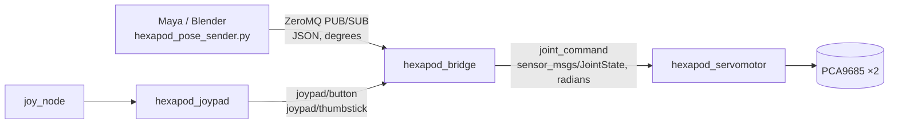

# The ZeroMQ bridge

`hexapod_bridge` is how a pose leaves Maya or Blender and reaches a servo. It
receives joint angles over ZeroMQ, publishes them into the ROS 2 graph, and
gives the joypad the power to freeze everything.

The reasoning behind choosing ZeroMQ over gRPC is recorded separately, in
[driving the hexapod from Maya or Blender](maya-blender-bridge.md).

- [The chain](#the-chain)
- [The joypad wins](#the-joypad-wins)
- [The message format](#the-message-format)
- [Parameters](#parameters)
- [The Python sender](#the-python-sender)
- [Running it](#running-it)
- [What is validated](#what-is-validated)
- [Units](#units)
- [What this does not do](#what-this-does-not-do)

## The chain



Everything from the bridge rightwards is ROS 2 over DDS on the robot itself.
The only thing crossing the network is the ZeroMQ link, which is a single
unicast TCP connection — see the transport notes for why that matters over
WiFi.

## The joypad wins

Two sources want the robot. The rule is one sentence: **touching the joypad
freezes the joints, and the stream takes over again once the joypad has been
quiet for `override_timeout_ms`.**

```
    stream driving                joypad touched              1500 ms quiet
  ─────────────────────▶  │  ─────────────────────────▶  │  ─────────────────▶
   poses forwarded            poses dropped,                 poses forwarded
   to the servos              joints hold their last         again
                              commanded angles
```

Freezing is the whole of the override. The joypad commands no angles of its
own, because nothing in this workspace knows how to turn a thumbstick into
eighteen joint angles — that needs a gait engine or an inverse kinematic model,
and inventing one would move real servos in ways nobody designed. What exists
is the manual stop for a machine being driven by an animation, which is the
part that has to work first.

A gait node can be added later without touching any of this: it publishes onto
`joint_command` and the arbitration is already there.

Two details that stop the override being annoying in practice:

- **A dead zone.** A worn thumbstick never returns exactly to centre. Only a
  push past `thumbstick_deadzone` counts as deliberate, or the robot would
  freeze on noise and never move again.
- **Only presses, never releases.** Letting go of a button starts the release
  timeout rather than handing the robot straight back, so the stream cannot
  resume in the middle of an operator's reaction.

Both handovers are logged, once per transition rather than once per pose.

## The message format

One JSON object per message:

```json
{
  "schema": 1,
  "seq": 42,
  "units": "deg",
  "joints": {"L_coxaA": 90.0, "L_femurA": 45.0}
}
```

| Field | Meaning |
|---|---|
| `schema` | Format version. A version this build does not know is refused outright. |
| `seq` | Sender's counter. Optional; used only to report poses lost in flight. |
| `units` | Must be `deg`. Its whole purpose is to make a sender working in radians fail loudly. |
| `joints` | Motor name to angle, in degrees, `0`–`180`. Names are those in `motors.lua`. |

JSON rather than a packed binary layout, on purpose: the names travel with the
values, so the two ends cannot silently disagree about the order of eighteen
numbers. At fifty poses a second the verbosity costs a few tens of kilobytes
per second, which is nothing on this link.

The socket is opened with `ZMQ_CONFLATE`, so only the newest message is kept.
This is not tuning. A stalled link must not build a queue of stale poses that
the robot then replays at full rate — a late pose is dropped in favour of the
current one.

## Parameters

Defaults live in `src/hexapod_bridge/config/bridge.yaml`, which is ordinary ROS
parameter YAML, so `ros2 param` and launch-time overrides work on it as usual.

| Parameter | Type | Default | Meaning |
|---|---|---|---|
| `endpoint` | string | `tcp://0.0.0.0:5556` | Where the pose stream arrives |
| `bind` | bool | `true` | Bind the endpoint; the robot binds, the workstation connects |
| `output_topic` | string | `joint_command` | Topic the decoded poses are published on |
| `poll_period_ms` | int | 5 | How often the socket is drained |
| `override_timeout_ms` | int | 1500 | Joypad quiet time before the stream resumes |
| `thumbstick_deadzone` | double | 0.25 | Magnitude below which a stick is at rest |

The servo node gained two parameters of its own:

| Parameter | Type | Default | Meaning |
|---|---|---|---|
| `command_topic` | string | `joint_command` | Topic the poses arrive on |
| `write_rate_hz` | double | 10.0 | How often a stored pose is written to the boards |

`write_rate_hz` exists because writing a pose is slow. `WriteOnMotor` waits
`settle_time_ms` after every motor, so a full eighteen-joint pose takes
`18 × settle_time_ms` — 900 ms at the shipped default. Poses are therefore
stored as they arrive and written on a timer; one that is overtaken before the
timer runs is never written, which is the right answer for a robot.

### Configuring a container

docker compose sets `HEXAPOD_BRIDGE_*` environment variables, which the launch
file turns into parameter overrides. The mapping is one to one:
`HEXAPOD_BRIDGE_OVERRIDE_TIMEOUT_MS` overrides `override_timeout_ms`. A
variable that is set but unreadable stops the launch rather than falling back to
the file, so a typo in a compose file cannot quietly run the robot on a
configuration nobody asked for.

## The Python sender

`tools/hexapod_pose_sender.py` is the workstation half. It is a single file
with one dependency, `pyzmq`, chosen because it installs cleanly into the
Python that Maya and Blender ship.

```python
from hexapod_pose_sender import PoseSender

sender = PoseSender()
sender.send({"L_coxaA": 90.0, "L_femurA": 45.0})
```

**It contains no robot logic** — no gait, no interpolation, no kinematics. It
moves a dictionary of angles onto a socket. Whatever decides those angles stays
in the animation package.

The socket is a `PUB`, which never blocks and never queues: if the bridge is not
listening the poses are discarded, so the animation package is never stalled by
the network.

Run it directly for a connectivity check:

```sh
python3 tools/hexapod_pose_sender.py --endpoint tcp://raspberrypi.local:5556 --rate 10
```

That sends a fixed mid-travel pose. It exists to prove the socket, the bridge
and the servos are talking to each other — it is not an example of how to drive
the robot, and the rest position it does *not* use is the one in `homing.lua`.

## Running it

Everything at once, which is what the container does:

```sh
ros2 launch hexapod_bridge hexapod.launch.py
```

Parts of it:

```sh
# no I2C hardware, for a workstation
ros2 launch hexapod_bridge hexapod.launch.py with_servos:=false with_joypad:=false

# the bridge on its own
ros2 launch hexapod_bridge hexapod_bridge.launch.py

# watch what arrives
ros2 topic echo /joint_command
```

## What is validated

This payload crosses a network from a program that has no idea a robot is on the
other end, so nothing about it is taken on trust. Rejected are: anything that is
not a JSON object, an unknown `schema`, `units` other than `deg`, a missing or
empty `joints`, a joint named with an empty string, a value that is not a number,
a non-finite angle, and any angle outside `0`–`180`.

A rejected payload is **logged and dropped, not thrown**. A node that died on a
bad packet would be a node any unrelated program could switch the robot off
with. Every rejection is counted and reported, throttled so a misconfigured
sender cannot flood the log.

The servo node validates again on its own side — mismatched name and position
array lengths, empty commands, non-finite angles — and a joint name the motor
table does not know is reported and skipped rather than being matched by
position to whichever motor happens to sit at that index.

## Units

| Where | Unit | Why |
|---|---|---|
| ZeroMQ payload | degrees | The unit the robot is configured in: `homing.lua`, `motors.lua` and the 0–180 servo range |
| `sensor_msgs/msg/JointState` | radians | The ROS standard; the URDF and `robot_state_publisher` have to agree with it |
| PCA9685 | microseconds | Pulse width, mapped from degrees by the driver |

The conversions happen once each, at the boundaries: degrees to radians in the
bridge, radians back to degrees in the servo node. Keeping `JointState` in
radians is what lets the same topic drive RViz and the real joints.

## What this does not do

- **No gait, no inverse kinematics.** The bridge carries poses; it does not
  invent them.
- **No authentication or encryption.** The link is unicast TCP on a trusted LAN.
  Anyone who can reach the port can move the robot — do not forward it.
- **No watchdog on the stream.** If the animation stops sending, the joints stay
  where the last pose put them. The joypad freeze is the manual stop; an
  automatic park on silence is not implemented, and is the obvious next thing to
  add.
- **No feedback.** Hobby servos report nothing, so nothing is published back
  about where the joints actually are.
